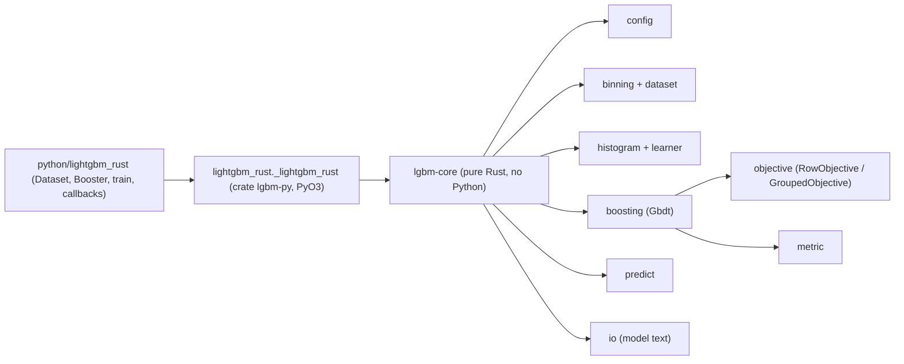

# Architecture

lightgbm-rust is a from-scratch Rust implementation of LightGBM's gradient boosting. It does not link to, wrap, or call the upstream C++ library at run time. Upstream (v4.7.0, commit `8f7036f`, MIT) is used as a source reference for ported algorithms and, in tests only, as the reference engine (PyPI wheel).

## Crates and modules

### `crates/lgbm-core`
This crate holds all modeling logic. It has no Python dependency and is usable directly from Rust; `tests/end_to_end.rs` trains, saves, loads, and predicts without Python. Modules are layered so that none depends on a later one:

| module | responsibility | upstream counterpart |
|---|---|---|
| `consts`, `error`, `fmt`, `random` | constants (`kZeroThreshold`, `kEpsilon`), error type, `%g`/`%.17g` float formatting, upstream LCG RNG | `meta.h`, `common.h`, `random.h` |
| `config` | parameter table generated from `config.h` (`docs/compat/params.json`): alias resolution, typed parsing, checks, model `parameters:` block | `config.h`, `config.cpp`, `config_auto.cpp` |
| `binning` | `BinMapper::find_bin` (numerical): greedy bin finding, zero/NaN bins, missing types, trivial-feature filter | `bin.cpp` |
| `dataset` | `DenseMatrix` (borrowed input), sampling, per-column bin mappers, binned columns (u8/u16/u32), `Metadata` (label/weight/init_score) | `dataset_loader.cpp`, `dataset.cpp`, `metadata.cpp` |
| `feature_groups` | upstream's feature-bundling group search, used only to reproduce upstream's inner feature order (it seeds the `extra_trees` RNGs) | `dataset.cpp` `FastFeatureBundling`, `FindGroups` |
| `sample_strategy` | row sampling per iteration: bagging (incl. balanced) and GOSS; in-bag/out-of-bag indices | `bagging.hpp`, `goss.hpp` |
| `objective` | `RowObjective`, `GroupedObjective`, `GradHessBlock`, `HessianMode`, `DiagonalReduction`; the regression family (`regression`, `regression_l1`, `huber`, `fair`, `poisson`, `quantile`, `mape`, `gamma`, `tweedie`, incl. `reg_sqrt`), upstream's percentile functions, `binary`, `multiclass`, `multiclassova` | `objective_function.h`, `regression_objective.hpp`, `binary_objective.hpp`, `multiclass_objective.hpp`, `utils/array_args.h` |
| `metric` | `l2`, `rmse`, `l1`, `quantile`, `huber`, `fair`, `poisson`, `mape`, `gamma`, `gamma_deviance`, `tweedie`, `binary_logloss`, `binary_error`, `auc`, `multi_logloss`, `multi_error` | `regression_metric.hpp`, `binary_metric.hpp`, `multiclass_metric.hpp` |
| `tree` | tree arrays, decision types, leaf outputs, model text serialization | `tree.cpp` |
| `histogram` | per-feature histograms, most-frequent-bin fix-up | `dense_bin.hpp`, `Dataset::ConstructHistograms`/`FixHistogram` |
| `learner` | leaf-wise serial tree learner: data partition (restricted to the in-bag rows when sampling), histogram subtraction, numerical split search with missing handling and `extra_trees` random thresholds, leaf output with L1/L2/`max_delta_step`/`path_smooth`; `col_sampler` for `feature_fraction`/`feature_fraction_bynode` | `serial_tree_learner.cpp`, `feature_histogram.hpp`, `data_partition.hpp`, `col_sampler.hpp` |
| `boosting` | `Gbdt`: boost-from-average, gradients, training iterations, rollback, score updates for train/valid, evaluation, feature importance | `gbdt.cpp`, `score_updater.hpp` |
| `predict` | raw/transformed/leaf-index prediction with iteration windows | `predictor.hpp`, `gbdt_prediction.cpp` |
| `io` | model text read/write (byte-identical to upstream for the supported subset) | `gbdt_model_text.cpp` |
| `array_args` | `ArgMax` etc. with upstream tie-breaking | `array_args.h` |

Ported code carries `upstream: <file> <function>` comments. Ported C++ tests carry `// upstream: tests/cpp_tests/<file>.cpp TEST(<suite>, <name>)`.

### `crates/lgbm-py`
This crate is the PyO3 extension module `lightgbm_rust._lightgbm_rust` (abi3, Python ≥ 3.10). It only converts between Python and core types, through two classes, `RsDataset` and `RsBooster`, plus a few functions (`param_specs`, `validate_params`, `dataset_update_param_checking`). No modeling decisions are made here.

### `python/lightgbm_rust`
This is the user-facing API, mirroring `lightgbm` 4.7.0: `Dataset`, `Booster`, `train`, `callback` (a near-verbatim port of upstream `callback.py`), `register_logger`, `EvalResult`, and `Sequence`.
- **Ported from upstream Python.** Parameter handling (`_choose_param_value`, alias table, `_update_params`), lazy `Dataset.construct`, and the `train()` control flow are ported from upstream's Python code, with attribution, so that upstream's Python tests exercise the same paths.
- **Unsupported features.** Features that do not exist yet raise `LightGBMError("not supported by lightgbm-rust yet: ...")`. They never silently fall back.

## Data ownership and lifetimes

- **Input matrices are borrowed.** A float32/float64 NumPy array that is C- or F-contiguous is viewed as `DenseMatrix<'a>` (`DenseValues::F32/F64`, row- or column-major) for the duration of one call (`RsDataset::new`, `RsBooster::predict`). The binding holds a read-only NumPy borrow, so no copy is made.
- **Inputs that are copied.** Other dtypes are converted to float32 and non-contiguous arrays are made contiguous (both upstream behavior). pandas frames go through `to_numpy`, and a list of 2-D arrays is stacked. All of these are copies.
- **No reference to caller memory outlives a call.** A `Dataset` owns its binned columns and metadata.
- **Datasets are shared, immutable values.** `RsDataset` holds `Arc<Dataset>`. A booster holds clones of the `Arc` for its training and validation data. Setting a field after a booster exists (`Dataset.set_label`, etc.) uses `Arc::make_mut`, i.e. copy-on-write. The booster therefore keeps the data it was trained with, and no aliasing mutation is possible.
- **Validation datasets.** These clone the training set's bin mappers (`Dataset::from_dense_with_reference`), like upstream `CreateValid`.
- **Booster state.** `Gbdt` owns its trees, config, objective, and an optional `TrainState` (gradients, score updaters, dataset `Arc`s). `free_training_state` drops the training state; a model loaded from text has none.

## Threading and determinism

- **Two kinds of workers.**
  - **Rayon pool.** Each `Gbdt` owns an optional rayon pool sized by `num_threads` (≤ 0 means the global rayon pool, all cores). Bin finding, gradients, validation-score updates, and prediction run inside `pool.install`, so two boosters with different thread counts do not interfere.
  - **`ThreadTeam`** (`threading.rs`). The tree learner runs several short parallel regions per leaf. For these it owns a fixed team of threads, like an OpenMP team. Idle workers spin for 200 µs (like libgomp's spin count) and then park on a condvar. Tasks are claimed from a shared counter, so a descheduled worker delays only the task it holds. Regions below `MIN_PAR_WORK` estimated operations run inline. The team keeps the *logical* thread count for partitioning work, but starts at most one OS thread per logical CPU.
- **Histograms** (`multi_val_bin.rs`, `histogram.rs`).
  - **Row-wise (default, and `force_row_wise`).** This mirrors upstream `MultiValDenseBin` and `MultiValBinWrapper::ConstructHistograms`. All features' bins are stored row-major. Rows are split into blocks by upstream's `Threading::BlockInfo` with the same `min_block_size` formula. Each block accumulates into its own buffer, and the buffers are merged in block order (`HistMerge`). Results therefore match upstream exactly at the same thread count.
  - **Col-wise (`force_col_wise`).** Each feature's histogram is accumulated sequentially in data-index order, in parallel over features.
  - **Split search** is parallel over features in both modes.
- **Partition** (`learner/partition.rs`). Leaves with at least 16,384 rows are split in blocks with a prefix-sum copy-back, like upstream's `ParallelPartitionRunner`. The row order inside each child is therefore stable and independent of the thread count. The inner loop is branchless.
- **Prediction** (`predict.rs`). Each tree is flattened and walked branchlessly with 16 rows at a time, so the independent root-to-leaf paths overlap in the pipeline. Each row still sums its trees in model order, so outputs are bitwise identical to per-row traversal; a Rust test checks this.
- **Determinism.**
  - **Col-wise:** no floating-point reduction is split across threads, so results are bitwise independent of the thread count.
  - **Row-wise:** results depend on the thread count through the block partition, exactly as upstream's do. The differential suite checks 4-thread row-wise training against upstream at 4 threads (exact), and col-wise at 4 threads against 1 thread.
  - **GOSS:** rows are sampled per thread block (`Threading::BlockInfoForceSize`), so GOSS results depend on the thread count in both histogram modes, as upstream's do. The differential suite checks 4-thread GOSS against upstream at 4 threads. Bagging, feature fraction, and extra trees use sequential RNG streams and are thread-independent.
  - **Sequential sums:** root gradient sums and `BoostFromScore` label means are always sequential. This equals upstream with `deterministic=true`. Without it, upstream uses an OpenMP reduction whose rounding depends on the thread count; the benchmark shows such differences of up to 1.8e-15 on regression.
- **GIL.** Every long-running binding call (dataset construction, `update`, `predict`, model parse/serialize) runs under `Python::detach`, which releases the GIL. `tests/python/test_api.py` verifies this with a ticker thread. Input arrays are borrowed read-only before releasing the GIL. Callers must not mutate an array from another thread during the call; the same rule applies to upstream.

## Errors

- **Core errors.** Core functions return `Result<T, LgbmError>`, with these variants:
  - `InvalidParameter`
  - `InvalidData`
  - `ModelFormat`
  - `Unsupported` (message prefix `not supported by lightgbm-rust yet:`)
  - `Internal`

  Where upstream has a specific message (e.g. `Cannot change max_bin after constructed Dataset handle.`, `Length of label (...) is not same with #data (...)`), the same text is used.
- **Panics.** The core uses checked indexing and does not intentionally panic on user input.
- **Exception mapping.** The binding maps `LgbmError` to `lightgbm_rust.LightGBMError` (an `Exception` subclass, like upstream's). All binding entry points run under `catch_unwind`, which turns a panic into `LightGBMError("internal error (panic) in lightgbm-rust: ...")` instead of aborting the interpreter.
- **Warnings.** Non-fatal diagnostics (alias conflicts, unknown parameters, whitespace in feature names, `max_depth` without `num_leaves`, no informative features) are collected as strings by the core. The Python layer then emits them exactly as upstream's C++ log callback does: through the registered logger's `info` method, as `[LightGBM] [Warning] <msg>`, and only while the process-global log level is ≥ 0. That level changes only when a parameter set contains `verbosity` or `verbose`.

## Objective extension design

Two traits live in `crates/lgbm-core/src/objective/mod.rs`.

- **`RowObjective`** is the conventional per-row objective, equivalent to upstream `ObjectiveFunction`. It provides:
  - `name`, `num_outputs`, and `init(meta, num_data)`;
  - `gradients(scores, grad: &mut [f32], hess: &mut [f32])`, with class-major layout `k * num_data + i` and `f32` buffers like upstream `score_t`;
  - `boost_from_score(k)`, `class_need_train(k)`, `convert_output(raw, out)`, and `to_model_string()`.
- **`GroupedObjective`** is for objectives with grouped rows (all months of one loan, time-ordered), K > 1 outputs per row, and coupling across outputs and/or rows. It provides:
  - `num_outputs`, `hessian_mode()`, `diagonal_reduction()`, and `init(meta, groups)`;
  - `gradients(scores, groups, out: &mut GradHessBlock)`;
  - `loss(scores, groups)`, used by finite-difference tests and as a training-loss metric;
  - `boost_from_score`, `convert_output`, and `to_model_string`.
- **`GroupIndex`** holds contiguous row ranges, one per group (built from sizes or from contiguous row ids).
- **`GradHessBlock`** holds `f64` gradients, the Hessian diagonal, and, depending on `HessianMode`, either a row-major `K x K` block per row (`BlockPerRow`, e.g. cross-event terms of competing risks) or a dense `(mK) x (mK)` block per group of `m` rows (`BlockPerGroup`, cross-time terms).
- **Reduction to the diagonal is explicit.** The tree learner consumes only a diagonal Hessian. A `GroupedObjective` must declare how its block is reduced, through `DiagonalReduction`:
  - `Exact`: only allowed for genuinely diagonal objectives.
  - `DropOffDiagonal`: a Newton approximation that ignores coupling.
  - `GershgorinBound`: row sums of `|H|`. For a convex loss this majorizes the Hessian, giving a conservative majorize-minimize step.

  The choice is written to the model's `objective=` line as `hessian_reduction:<name>`, so a model always records what was dropped. Nothing is dropped silently.
- **`Objective`** is the enum the booster holds: `Row(Box<dyn RowObjective>)` or `Grouped { objective, groups }`. It converts a `GradHessBlock` into the learner's `f32` buffers. With no objective (`objective="none"`/custom), the Python layer passes gradients and Hessians from `fobj` through `update_custom`.
- **Built-in objectives.** The regression family (one `Regression` type over `RegressionKind`: L2, L1, Huber, Fair, Poisson, quantile, MAPE, gamma, Tweedie, with `reg_sqrt` where upstream allows it) binary log loss (`binary`, with `sigmoid`, `is_unbalance`, `scale_pos_weight`), and the K-output `multiclass` (softmax) and `multiclassova` (one `BinaryLogloss` per class, positive when `(int)label == c`) implement `RowObjective`. Their formulas, `f32`/`f64` cast order, and `BoostFromScore` follow upstream exactly; the gradients are bitwise equal in the differential tests. Finite-difference tests check all gradients, and the Hessians where they are the true second derivative. L1, quantile, and MAPE implement `renew_leaf_output`; the booster calls it per leaf after each tree is grown and before shrinkage, as upstream `GBDT::TrainOneIter` does. A synthetic test-only `GroupedObjective` with cross-row coupling has its full block Hessian checked by finite differences, and is driven through the `Objective` enum.

### Deviations from the milestone plan's sketched signatures
The plan sketched `init_score(labels, weights) -> Vec<f64>`, `gradients(scores, grad, hess)`, and `transform(raw, out)` for `RowObjective`, and a `groups()` accessor on `GroupedObjective`. The implementation differs:
- **`init` + `boost_from_score(k)` instead of `init_score`.** This mirrors upstream's `Init`/`BoostFromScore` split, which is needed for bitwise parity: the init score depends on config such as `boost_from_average`, and is computed per output.
- **`convert_output` instead of `transform`.** This is upstream's name. It operates on one row's K outputs.
- **`name`, `class_need_train`, and `to_model_string`.** These were added because model text IO and multi-output boosting need them.
- **The group index is passed in rather than owned and exposed by the objective.** `Objective::Grouped` owns the `GroupIndex`, so the booster can validate it against the dataset (`groups.num_rows() == num_data`) before training, and the same objective type can be reused with different panels.
- **`hessian_mode`, `diagonal_reduction`, and `loss` on `GroupedObjective`.** These make the curvature structure and its reduction explicit and testable.

### Not yet built (beyond milestone 3)
- **No concrete `GroupedObjective`.** None is implemented and none is exposed to Python. The hazard objective is at design-note stage only: see [hazard/design-note.md](hazard/design-note.md).
- **No grouped data path from Python.** Constructing a `Dataset` with `group` raises "not supported".